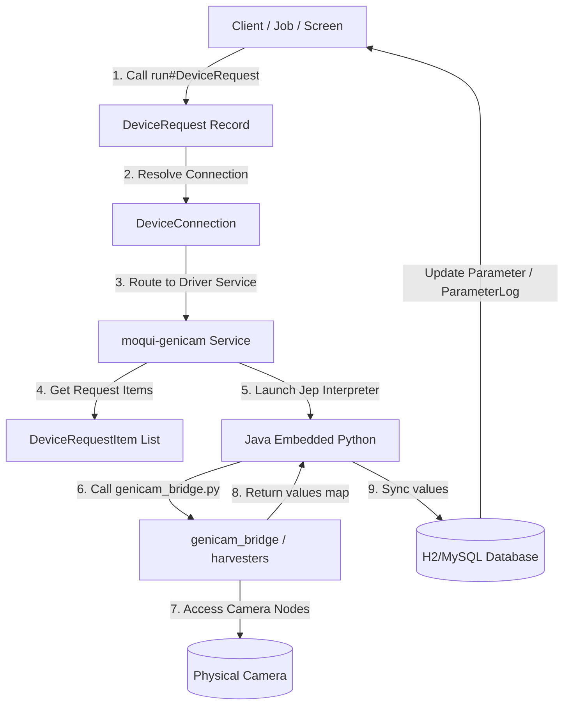

# moqui-genicam

`moqui-genicam` is a data-driven integration component for the Moqui Framework. It provides configuration, control, and data acquisition capabilities for multi-brand vision cameras (e.g., FLIR, Basler, IDS, Baumer) by bridging Moqui's digital twin entity model (`moqui-device`) with the industry-standard **GenICam** framework via **JEP** (Java Embedded Python) and the Python **Harvesters** library.

---

## The GenICam Standard

**GenICam** (Generic Interface for Cameras) is the global standard administered by the European Machine Vision Association (EMVA). It provides a generic software interface for all kinds of cameras, regardless of the underlying physical interface (GigE Vision, USB3 Vision, CoaXPress, Camera Link, etc.) or the camera manufacturer. 

The standard consists of three main modules:
1. **GenApi**: A standardized XML description file format (typically embedded in the camera's non-volatile memory) that describes all the camera's features (such as `ExposureTime`, `Gain`, `TriggerMode`, `ImageWidth`) as hierarchical nodes, detailing their access modes, ranges, and types.
2. **GenTL**: The GenICam Transport Layer, which handles physical communication and enumerates devices using producer drivers (`.cti` libraries).
3. **SFNC**: The Standard Features Naming Convention, which ensures that standard features (like trigger control or exposure time) use the same node names across different camera brands.

By leveraging GenICam, `moqui-genicam` can interact with any camera that supplies a GenTL driver and standard GenApi node definitions, eliminating manufacturer lock-in.

---

## Data-Driven Philosophy with `moqui-device`

Traditionally, camera integrations rely on hardcoded SDK wrappers, forcing developers to compile and deploy brand-specific code to adjust basic settings. `moqui-genicam` breaks this paradigm by employing a fully **data-driven design** built on Moqui's native `moqui-device` and `moqui-math` models:

*   **Digital Twin representation**: The database defines what the camera is. A catalog model (`moqui.device.Device`) specifies the camera's capabilities, while a physical instance (`moqui.device.PhysicalDevice`) tracks the hardware instance deployed in the field (serial number, model name, vendor name).
*   **Metadata over Code**: Camera parameters (e.g., exposure time, gain, pixel format) are declared as database records (`moqui.math.ParameterDef`). Features like min/max boundaries and read/write permission types (`PpeReadWrite`, `PpeWrite`) are fetched directly from the database, allowing Moqui to validate recipe configurations (recipes or configurations defined via `DeviceConfig`) before sending commands to the physical camera.
*   **Decoupled parameter states**: The physical value of a parameter at any point in time is decoupled from the camera connection itself. Current states are captured in `moqui.math.Parameter`, and historical variations are tracked in `moqui.math.ParameterLog`.
*   **No Code Generation**: Adding support for a new camera model or new camera parameters is as simple as inserting database seeds (XML files like `GenicamTestData.xml`). The core execution engine remains untouched.

---

## The `run#DeviceRequest` Architecture

A core design principle of Moqui's device ecosystem is the separation of **logical request configuration** from **physical protocol execution**. This unified execution philosophy is shared across all Moqui hardware integration components, including **`moqui-plc4j`** (for PLCs and industrial controllers) and **`moqui-genicam`** (for machine vision).

### Unified Execution Pattern

At the heart of this abstraction lies the standard service interface:
`moqui.device.DeviceServices.run#DeviceRequest` (routed internally to `run#DeviceRequestInternal`).



### How it Works (Common to PLC4J and GenICam)

1.  **DeviceRequest (The Action Boundary)**: 
    An execution is triggered by calling a specific `DeviceRequest` (e.g., `FLIR_ReadState`, `FLIR_TriggerShot`). The request defines the intent (Read, Write, or Cyclic) and links to a specific `DeviceConnection`.
2.  **DeviceRequestItem (The Query Mapping)**: 
    Each request contains multiple items (`DeviceRequestItem`). The items act as a translator:
    *   They link a Moqui `Parameter` (e.g., `ParameterId 11001` representing Exposure Time) to a protocol-specific **Query String**.
    *   In **`moqui-plc4j`**, the Query String translates to a PLC address (e.g., `holding-register:2:UINT` or `STATE/9000:REAL`).
    *   In **`moqui-genicam`**, the Query String translates to a GenICam node name (e.g., `ExposureTime`, `Gain`, `TriggerSoftware`).
3.  **Protocol-Specific Runner**:
    The core `run#DeviceRequest` engine routes the operation to the target component's implementation based on the driver declared in `DeviceConnection` (e.g. `genicam` vs `modbus` or `simulated`). 
    *   `moqui-plc4j` resolves registers via Apache PLC4J and maps the bytes to decimal/boolean fields.
    *   `moqui-genicam` resolves JEP, runs `genicam_bridge.py` using standard python mapping, and syncs numeric or symbolic properties.
4.  **Automatic Synchronization & Auditing**:
    Once the values are read or written, the driver updates `moqui.math.Parameter` and appends entries to `moqui.math.ParameterLog`. This ensures a uniform historical record of telemetry and commands across all sensors, PLCs, and cameras in the factory.

---

## Component Layout

*   **`component.xml`**: Declares module dependencies (`moqui-math`, `moqui-device`, `moqui-jep`).
*   **`build.gradle`**: Builds, configures JEP environment, and manages testing libraries (Spock).
*   **`data/GenicamTestData.xml`**: Seed data containing definitions for the `FLIR BFS-PGE-120S6C-C` camera, including connection settings and requests.
*   **`script/genicam_bridge.py`**: Python script handling Harvesters interactions and GenICam node mappings, with a JSON-based file fallback mock camera simulation for hardware-less testing.
*   **`service/moqui/genicam/GenicamServices.xml`**: Groovy execution engine using JEP to run the Python bridge and map outputs back to the database.
*   **`src/test/groovy/GenicamServiceTests.groovy`**: Spock integration tests validating read and write behaviors under mock mode.

---

## Testing & Verification

The component includes integration tests that run out-of-the-box using the mock camera simulation mode.

To run the automated tests, execute the following from the Moqui root directory:
```bash
.\gradlew.bat :runtime:component:moqui-genicam:test --no-daemon
```
