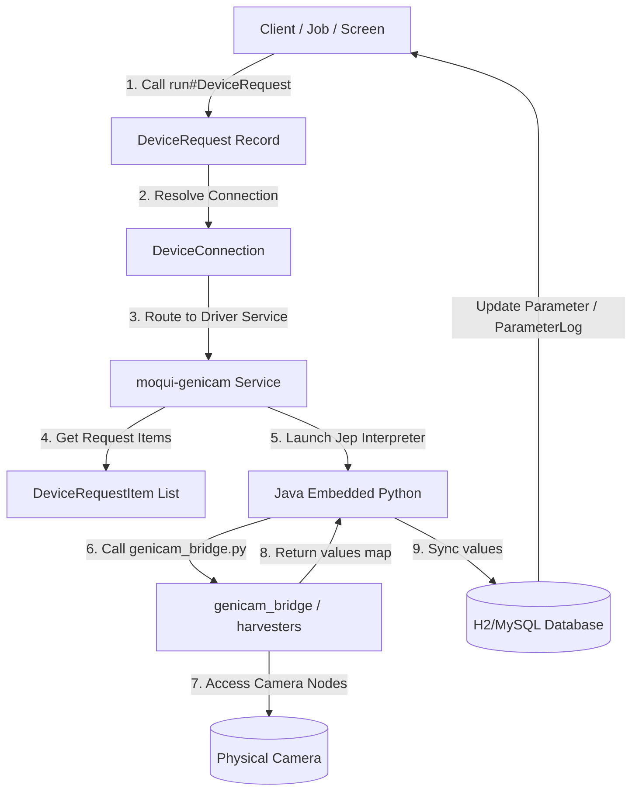

# moqui-genicam

`moqui-genicam` is a **model-first** and **data-driven** integration component for the Moqui Framework. It provides configuration, control, and data acquisition capabilities for multi-brand vision cameras (e.g., FLIR, Basler, IDS, Baumer) by bridging Moqui's digital twin entity model (`moqui-device`) with the industry-standard **GenICam** framework via **JEP** (Java Embedded Python) and the Python **Harvesters** library.

---

## Model-First & Data-Driven Philosophy

In traditional systems, integrating machine vision cameras requires proprietary SDKs and custom, hardcoded wrappers. When parameters like exposure time, trigger source, or resolution need to change, developers are forced to write new code, rebuild, and redeploy.

`moqui-genicam` eliminates this coupling by treating cameras, configurations, and commands entirely as **data**:

*   **Model-First Digital Twin**: The system models physical cameras as database entities (`moqui.device.Device` and `moqui.device.PhysicalDevice`). You configure the camera profile, capability sets, and physical parameters as structured records.
*   **Data-Driven Node Mapping**: Every camera feature (e.g., `ExposureTime`, `Gain`, `TriggerMode`) is mapped to a database definition (`moqui.math.ParameterDef`). Moqui uses these definitions to dynamically execute read and write requests without requiring hardcoded setter or getter methods for each parameter.
*   **Zero Code Generation**: Adding support for a new camera model or exposure parameter is as simple as inserting database seed data (XML files like `GenicamTestData.xml`). The core integration code remains unchanged and generic.
*   **Decoupled Parameter Logs**: Physical camera states are continuously tracked. Real-time values map to `moqui.math.Parameter`, while historical states are saved to `moqui.math.ParameterLog` for telemetry audits.

---

## Core Features & Enhancements

This component includes major runtime enhancements designed for production-grade machine vision deployments:

### 1. OpenCV-Backed Pixel Format Conversion
The Python bridge dynamically reads raw camera buffer components and converts them into standard BGR/JPEG format using **OpenCV**. It supports:
- **Mono8** (grayscale)
- **RGB8 / BGR8** (color channels)
- **Bayer patterns** (`BayerRG8`, `BayerGR8`, `BayerGB8`, `BayerBG8`) with high-fidelity color reconstruction.

### 2. Continuous Asynchronous Live Streaming
- A background `AcquisitionThread` handles non-blocking image acquisition at the target frame rate.
- Streaming is initiated via database write requests (`AcquisitionStart=Execute`) and stopped via (`AcquisitionStop=Execute`).
- Cached frames are stored in memory and synchronized to disk upon request (`LatestFrame`).

### 3. Multi-Component Payload Support
- Handles multi-channel/multi-planar payloads by looping through all components inside the Harvesters buffer, allowing multi-modal imaging (e.g., combined 2D and 3D sensor streams).

### 4. Resilient Reconnection & Backoff Engine
- Protects against network drops or temporary camera power cycles.
- Automatically attempts connection recovery up to 3 times with exponential backoff (e.g., 1s, 2s, 4s delays) before propagating errors.

### 5. MJPEG Live Video Endpoint
- Includes the `stream#LiveMjpeg` service inside [GenicamServices.xml](file:///C:/Users/igorg/Desktop/moqui-genicam-test/moqui-framework/runtime/component/moqui-genicam/service/moqui/genicam/GenicamServices.xml).
- Pushes live frames directly to HTTP responses using the `multipart/x-mixed-replace` MIME type, compatible with web browsers.

---

## The GenICam Standard

**GenICam** (Generic Interface for Cameras) is the global standard administered by the European Machine Vision Association (EMVA). It provides a generic software interface for all kinds of cameras, regardless of the physical link (GigE Vision, USB3 Vision, CoaXPress, Camera Link) or vendor.

1.  **GenApi**: An XML file format embedded in the camera describing feature nodes.
2.  **GenTL**: The Transport Layer for hardware communication via producer drivers (`.cti`).
3.  **SFNC**: Standard Features Naming Convention to ensure standard feature names are consistent across brands.

---

## The `run#DeviceRequest` Architecture

A core design principle of Moqui's device ecosystem is the separation of **logical request configuration** from **physical protocol execution**. This unified execution philosophy is shared across all Moqui hardware integration components, including **`moqui-plc4j`** (for PLCs and industrial controllers) and **`moqui-genicam`** (for machine vision).

### Unified Execution Pattern

At the heart of this abstraction lies the standard service interface:
`moqui.device.DeviceServices.run#DeviceRequest` (routed internally to `run#DeviceRequestInternal`).



### How it Works
1.  **DeviceRequest (The Action Boundary)**: Runs target actions (e.g., `FLIR_ReadState`, `FLIR_StartStreaming`).
2.  **DeviceRequestItem (The Query Mapping)**: Translates database parameter IDs (e.g., `11001` Exposure Time) to GenICam nodes (e.g. `ExposureTime`).
3.  **JEP Execution Bridge**: Runs the python bridge which interfaces with the hardware and reports values back.
4.  **Automatic Synchronization**: Automatically writes results back to the Moqui database entities.

---

## Component Layout

*   **`component.xml`**: Declares module dependencies (`moqui-math`, `moqui-device`, `moqui-jep`).
*   **`build.gradle`**: Builds, configures JEP environment, and manages testing libraries (Spock).
*   **`data/GenicamTestData.xml`**: Seed data containing definitions for the `FLIR BFS-PGE-120S6C-C` camera, including connection settings, streaming control parameters, and requests.
*   **`script/genicam_bridge.py`**: Python script handling Harvesters interactions and GenICam node mappings, with a JSON-based file fallback mock camera simulation for hardware-less testing.
*   **`service/moqui/genicam/GenicamServices.xml`**: Groovy execution engine using JEP to run the Python bridge and map outputs back to the database.
*   **`src/test/groovy/GenicamServiceTests.groovy`**: Spock integration tests validating read, write, streaming, and frame capture behaviors under mock mode.
*   **`requirements.txt`**: Declares Python dependencies (`opencv-python`).

---

## Testing & Verification

The component includes integration tests that run out-of-the-box using the mock camera simulation mode.

To run the automated tests, execute the following from the Moqui root directory:
```bash
.\gradlew.bat :runtime:component:moqui-genicam:test --no-daemon
```
