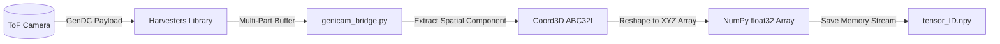
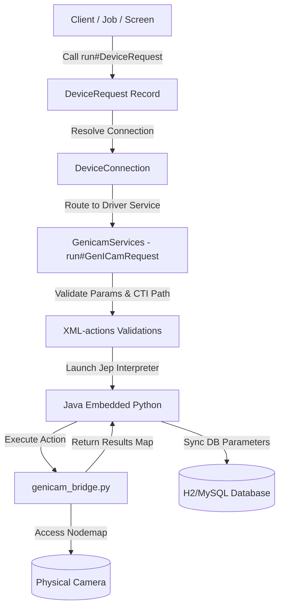

# moqui-genicam

`moqui-genicam` is a **model-first** and **data-driven** integration component for the Moqui Framework. It provides configuration, control, and data acquisition capabilities for multi-brand vision cameras (e.g., FLIR, Basler, IDS, Baumer) by bridging Moqui's digital twin entity model (`moqui-device`) with the industry-standard **GenICam** framework via **JEP** (Java Embedded Python) and the Python **Harvesters** library.

---

## 🌟 Why `moqui-genicam` is Unique

Unlike typical IP camera streams (e.g. RTSP/ONVIF) or standard wrapper libraries that treat vision cameras as simple video feeds, `moqui-genicam` is designed from the ground up for **industrial automation** and **advanced machine vision**:

1. **Model-First Digital Twin**: The camera's settings, capabilities, and registers are not hardcoded. They are declared in Moqui's database using the [moqui-device](file:///C:/Users/igorg/Desktop/moqui-genicam-test/moqui-framework/runtime/component/moqui-device) and [moqui-math](file:///C:/Users/igorg/Desktop/moqui-genicam-test/moqui-framework/runtime/component/moqui-math) schemas. Changes to exposure, triggers, or frame rates require zero code modifications.
2. **Zero-Copy & Zero Graphics Pipelines**: Raw image buffers and Time-of-Flight (ToF) coordinate maps are processed directly in memory. They bypass traditional OpenCV/Java graphics libraries, converting buffers straight into structured NumPy arrays (no unnecessary BGR conversions) and saving them as `.npy` binaries.
3. **Seamless Interoperability**: Combining the performance of Moqui's Java transactional engine with the data-science power of Python's scientific stack (NumPy, OpenCV) via Java Embedded Python (JEP) allows low-latency, thread-safe hardware access.
4. **Declarative XML Services**: Operations are organized via standard Moqui XML-actions. Database transactions, file cleanups, and camera status changes are executed declaratively with standard validation and logging.

---

## 🛠️ Core Features & 3D/ToF Integration

### 1. 3D & Time-of-Flight (ToF) Spatial Imaging
The driver incorporates complete support for **GenDC (GenICam Data Container) Multi-Part payloads** (Payload Types 6 and 7):
* **Component Extraction**: Automatically scans multi-part buffers to isolate spatial components (containing `Coord3D_ABC32f` or `Coord3D_C32f` formats).
* **Buffer-to-Tensor Conversion**: Raw binary buffers representing spatial 3D points are converted directly into NumPy float32 arrays (shape: `[Height, Width, 3]` representing $X, Y, Z$ spatial coordinates).
* **Binary Serialization**: Decoded arrays are serialized into standard `.npy` binary files using in-memory streams, bypassing standard image conversions that discard spatial precision.



### 2. Transactional Database Persistence (`moqui.math.Tensor`)
When a 3D frame is captured, `moqui-genicam` integrates the frame directly into Moqui's database using the `moqui-math` Tensor schemas:
* **Tensor Entity**: Saves a new `moqui.math.Tensor` record storing type (`TtDense`), purpose (`TpImageRep`), rank (3), and dimensions (e.g. `[480, 640, 3]`).
* **Axis Definitions**: Dynamically creates `moqui.math.TensorAxis` records defining dimensions and strides:
  * Axis 0: Height (`TapHeight` / `Y`)
  * Axis 1: Width (`TapWidth` / `X`)
  * Axis 2: Channels (`TapChannel` / `C` - coordinates $A, B, C$)
* **Content Record**: Creates a `moqui.math.TensorContent` record pointing to the `.npy` file location on disk.
* **Transactional Guarantee**: Database entries and disk writes are bound to a single transaction via JEP. If the file write or DB record creation fails, the transaction rolls back cleanly.

### 3. Resilient Fail-Safe & Status Transitions
To protect industrial workflows, camera connection and acquisition errors trigger automatic state changes:
* **Error Interception**: If a camera times out, disconnects, or fails to initialize, JEP intercepts the exception.
* **State Transition**: The `moqui.device.Device` record status is automatically transitioned to `DbsErrorStop` via Moqui Entity API directly from the Python bridge.
* **Backoff Retry**: Persistent connection attempts are retried up to 3 times with exponential backoff (1s, 2s, 4s) before declaring a hardware failure.

### 4. Scheduled Tensor Maintenance (Daily ServiceJob)
High-frame-rate 3D cameras generate massive amounts of data. `moqui-genicam` includes a background cleanup engine to prevent disk space exhaustion:
* **Daily Cron Job**: A scheduled job named `clean_GenICamTensors_daily` runs every day at 02:00 AM (`0 0 2 * * ?`).
* **Declarative Service**: Invokes the [clean#GenICamTensors](file:///C:/Users/igorg/Desktop/moqui-genicam-test/moqui-framework/runtime/component/moqui-genicam/service/moqui/genicam/GenicamServices.xml) service.
* **Safe Deletion Loop**: Locates all `TCntNpy` tensors older than the configured threshold (default: 30 days), deletes their physical `.npy` files, and clears matching `Tensor`, `TensorAxis`, and `TensorContent` DB entries in isolated, individual transactions to prevent row locking.

---

## 📋 Standard Architecture & Services

The component implements the standard `moqui.device.DeviceServices.run#DeviceRequest` interface.



### Services Summary

| Service Name | Purpose | Key Attributes |
| :--- | :--- | :--- |
| `run#GenICamRequest` | Processes read/write commands (e.g. exposure, triggers) | `transaction="ignore"` |
| `acquire#VideoStream` | Asynchronously captures a number of 2D/JPEG frames | `transaction="ignore"` |
| `stream#LiveMjpeg` | Pushes live MJPEG stream to web browsers via HTTP | `transaction="ignore"` |
| `acquire#GenICam3DFrame` | Decodes a GenDC 3D frame and persists it as a DB Tensor | `transaction="ignore"` |
| `clean#GenICamTensors` | Deletes old 3D tensor files and database records | `transaction="ignore"` |

---

## 🗂️ Component Directory Layout

*   [component.xml](file:///C:/Users/igorg/Desktop/moqui-genicam-test/moqui-framework/runtime/component/moqui-genicam/component.xml): Declares dependencies on `moqui-math`, `moqui-device`, and `moqui-jep`.
*   [build.gradle](file:///C:/Users/igorg/Desktop/moqui-genicam-test/moqui-framework/runtime/component/moqui-genicam/build.gradle): Manages builds and testing libraries.
*   [data/GenicamData.xml](file:///C:/Users/igorg/Desktop/moqui-genicam-test/moqui-framework/runtime/component/moqui-genicam/data/GenicamData.xml): Defines the scheduled cleanup `ServiceJob`.
*   [data/GenicamTestData.xml](file:///C:/Users/igorg/Desktop/moqui-genicam-test/moqui-framework/runtime/component/moqui-genicam/data/GenicamTestData.xml): Contains test camera definitions, connection configurations, and test requests.
*   [script/genicam_bridge.py](file:///C:/Users/igorg/Desktop/moqui-genicam-test/moqui-framework/runtime/component/moqui-genicam/script/genicam_bridge.py): Core Python bridge code (connecting Harvesters, decoding GenDC, converting pixel formats, and handling transactional persistence).
*   [service/moqui/genicam/GenicamServices.xml](file:///C:/Users/igorg/Desktop/moqui-genicam-test/moqui-framework/runtime/component/moqui-genicam/service/moqui/genicam/GenicamServices.xml): Declares Moqui services refactored using standard declarative XML-actions.
*   [src/test/groovy/GenicamServiceTests.groovy](file:///C:/Users/igorg/Desktop/moqui-genicam-test/moqui-framework/runtime/component/moqui-genicam/src/test/groovy/GenicamServiceTests.groovy): Spock integration tests covering reads, writes, streams, 3D frame capture, error transitions, and daily cleanups.
*   [requirements.txt](file:///C:/Users/igorg/Desktop/moqui-genicam-test/moqui-framework/runtime/component/moqui-genicam/requirements.txt): Declares required Python packages (`opencv-python`).

---

## 🚀 Testing & Verification

> [!NOTE]
> The test suite uses the simulated fallback mode if no real hardware is available or if the `.cti` driver file is missing, making it completely safe to run in automated CI/CD environments.

To run the integration tests:
```bash
.\gradlew.bat :runtime:component:moqui-genicam:test --no-daemon
```

> [!TIP]
> To configure real hardware, update the `DeviceConnection` records in your database to point to your physical GenTL driver (e.g. `C:\Program Files\Teledyne\Spinnaker\cti64\vs2015\Spinnaker_GenTL_v140.cti` on Windows) and set your camera's real serial number in the connection options.
